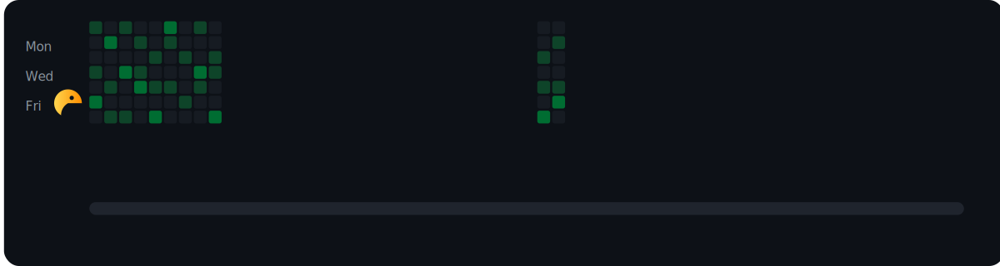

<!-- Banner (top) -->
<div align="center">
  
</div>

<div align="center">
  
# 👋 Hi there, I'm **Niranjan**


### 🌟 **Turning Ideas Into Interactive Tools**

<p>
  <a href="https://www.linkedin.com/in/niranjan-shanbhag-231676317/">
    
  </a>
  &nbsp;&nbsp;
  <a href="https://niranjans20.github.io/Student-Portfolio/">
    
  </a>
  &nbsp;&nbsp;
  <a href="https://www.instagram.com/nirxnjxn_03/">
    
  </a>
</p>

</div>

--- 

## 🧑‍💻 **About Me**


```javascript
const niranjan = {
    role: "Computer Engineering Student",
    location: "India 🇮🇳",
    passion: "Building clean, interactive tools",
    philosophy: "Learning by doing",
    currentFocus: ["Web Development", "Machine Learning", "System Design"],
    askMeAbout: ["Tech", "Innovation", "Problem Solving"],
    funFact: "I turn coffee into code ☕➡️💻"
};
```

<div align="left">
  <h3>🎯 What I'm up to:</h3>
  <ul>
    <li>🔭 Building innovative projects and learning new technologies</li>
    <li>🌱 Exploring advanced Machine Learning algorithms</li>
    <li>👥 Open to collaborating on exciting open-source projects</li>
    <li>💡 Always looking for ways to solve real-world problems</li>
  </ul>
</div>

<br clear="right"/>

---

## 🛠️ **Tech Stack & Tools**

<div align="center">

### **Languages**
<p>
  
  
  
  
  
  
</p>

### **Databases & ML**
<p>
  
  
  
</p>

### **Tools & Platforms**
<p>
  
  
  
  
</p>

</div>

---

## 🚀 **Featured Projects**

<div align="center">

<table>
<tr>
<td width="50%">

### 🌟 **Profile Portfolio**
**A clean, modern personal portfolio website**

🔹 **Tech:** HTML, CSS, JavaScript  
🔹 **Features:** Responsive design, smooth animations  
🔹 **Highlights:** Clean UI/UX, mobile-friendly  

<div align="center">
  <a href="https://niranjans20.github.io/Student-Portfolio/">
    
  </a>
</div>

</td>
<td width="50%">

### 🛍️ **Echoes of Heritage**
**Desktop app preserving global cultures**

🔹 **Tech:** Python, Tkinter, JSON  
🔹 **Features:** Cultural data management  
🔹 **Highlights:** Simple storage, intuitive UI  

<div align="center">
  
</div>

</td>
</tr>
<tr>
<td width="50%">

### 🛡️ **CyberDefend X**
**Comprehensive cybersecurity toolkit**

🔹 **Tech:** Python, Tkinter  
🔹 **Features:** Password testing, encryption  
🔹 **Highlights:** Security awareness, MFA simulation  

<div align="center">
  
</div>

</td>
<td width="50%">

### 🎮 [Crosswalk Dash Plus – Mumbai Traffic Challenge](https://crossing-project-game.vercel.app/)
Retro-style pixel game promoting traffic safety awareness  
🔹 **Tech:** HTML5 Canvas, CSS3, Vanilla JavaScript  
🔹 **Features:** Dynamic traffic simulation, swipe controls, real Mumbai safety facts  
🔹 **Highlights:** Fully mobile-compatible, educational gameplay  
[](https://crossing-project-game.vercel.app/)


</td>
</tr>
</table>

</div>

---

## 🎮 **Live Contribution Animations**

<div align="center">
  
</div>

---

## 📊 **GitHub Analytics**

<div align="center">


<br><br>


<br><br>


</div>

---

## 🏆 **Achievements & Trophies**

<div align="center">
  
</div>

---

## 💻 **Coding Activity**

<div align="center">
  
</div>

---

<div align="center">
  
</div>

---

## 🌟 **GitHub Highlights**

<div align="center">

### 📈 **Contribution Overview**


### 🎯 **Quick Stats**


</div>

---

## 🤝 **Let's Connect!**

<div align="center">

<h3>💬 I'm always open to interesting conversations and collaboration!</h3>

<p>
  <a href="https://www.linkedin.com/in/niranjan-shanbhag-231676317/">
    
  </a>
  <br><br>
  <a href="https://niranjans20.github.io/Student-Portfolio/">
    
  </a>
  <br><br>
  <a href="https://www.instagram.com/nirxnjxn_03/">
    
  </a>
</p>

<br>

### 📧 **Get in Touch**
<p>
  
  
</p>

### 📍 **Current Status**
<p>
  
  
</p>

</div>

---

<div align="center">

### ✨ **"The best way to predict the future is to invent it."** ✨


<br><br>

**Thanks for stopping by! Have an amazing day! 🚀**

<br>

### 🎮 **Fun Fact**
*These animated contribution graphs are generated daily using GitHub Actions and represent my real coding activity!*

</div>

<!-- Banner (bottom) -->
<div align="center">
  
</div>
